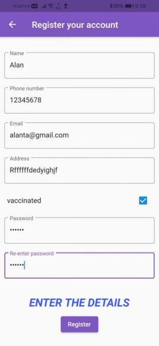
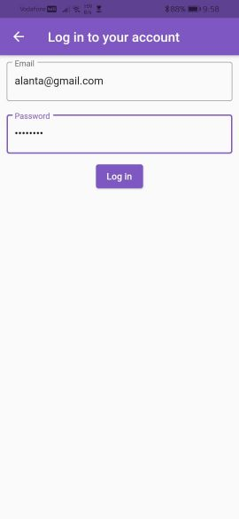
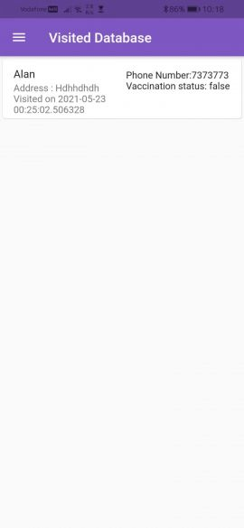

# CoViQrR

QR Code scanner for covid list

QR code scanner is a mobile application where shopkeepers have an app that shows QR code and users can scan this QR code which will automatically add that user to the visitor list. This should replace manual entry of contact details in the shop due to COVID.

## Team members

1. [Alan T A](https://github.com/alanta335)  
2. [Akhil Krishna S](https://github.com/ilmentore72)   

## Team ID

BFH/recdRQxvgOGx8Toyv/2021

## Link to product walkthrough

 [Video walkthrough](https://www.loom.com/share/56504be922274405a47afde25a27e1f3)
## Download APK

 [Release APK](https://github.com/alanta335/qr_code-_scanner_for_covid_list/raw/main/app-release.apk)

## Table of Contents

- [How it Works](#How-it-Works)
- [Libraries used](#Libraries-used)
- [How to configure](#How-to-configure)
- [How to Run](#How-to-Run)


## How it Works
1. Home Page \
   
2. Register account\
   
3. Log in Page\
    
4. 1. Scanning page for Customer\
     
   2. QR generation page for Store Owner\
     
5. Scanning QR code\
     
6. Add data page for customer\
     
7. Visited Database\
     
    
8. Common App Drawer\
     
9. Profile details\
     
10. Help page\
     
11. Vaccination status updation page\
     
12. About Developers\
     
    


## Libraries used

```
Environment:
   sdk: ">=2.12.0 <3.0.0"
minSdkVersion: 21
qr_flutter: 4.0.0
qr_code_scanner: 0.4.0
firebase_core: 1.2.0
firebase_auth: 1.2.0
cloud_firestore: 2.2.0
rflutter_alert: 2.0.2
flutter_spinkit: 5.0.0
url_launcher: 6.0.4
```

## How to configure
Instructions for setting up project
1. Setup [Flutter](https://flutter.dev/docs/get-started/install) 
2. Setup [Android SDK](https://developer.android.com/studio)
3. Clone the repository
4. Run the below command in the cloned directory.\
   ```flutter pub get```
5. Create a firebase project with name ```com.example.qr2``` (Default,Can be changed with some editing in AndroidManifest.xml) and download the JSON file    from Firebase\
6. Put the Firebase JSON file in  <project-directory>\android\app\
7. In the Firebase Console enable Firebase authentication(Email and Password).
8. In the Firebase enable Firestore and start a collection named 
   ```USER``` 

## How to Run
Instructions for running
   
### Debug mode
   
   1. Open the cloned repository
   2. In Terminal(Linux) or PowerShell(Windows) enter the command below to build and run debug while Android phone is connected via [Developer Mode](https://developer.android.com/studio/debug/dev-options)\
      ```flutter run```
   
### Release mode 
   1. Open the cloned repository
   2. In Terminal(Linux) or PowerShell(Windows) enter the command below to build and run release version while Android phone is connected via [Developer Mode](https://developer.android.com/studio/debug/dev-options)\
      ```flutter run --release```
### Build apk for release mode
   1. Open the cloned repository
   2. In Terminal(Linux) or PowerShell(Windows) enter the command below to build release APK 
      ```flutter build apk --release``` OR ```flutter build apk --release -split-per-abi``` for splitting APK per architecture
   3. Copy the APK file named ```app-release.apk``` from the directory ```<project-directory>/build/app/outputs/flutter-apk```
   4. [Install the APK in your phone](https://www.javatpoint.com/how-to-install-apk-on-android)
